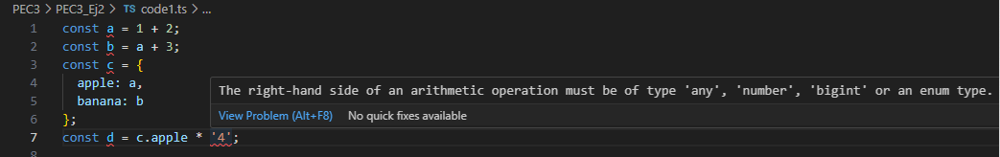

### PEC 3 - Ejercicio 2
#### Conociendo Typescript


**Modifica el código para conseguir que aparezca una línea roja de error en el IDE avisándote de que se está disparando un TypeError.**


```js

var a = 1 + 2;
var b = a + 3;
var c = {
    apple: a,
    banana: b
};

//si el numero 4 lo convertimos a un dato de tipo string, 
//nos debería dar un error de tipo ya que estamos  haciendo una opearción
var d = c.apple * '4';  

```
Efectivamente si convertimos el 4 en un string el propio editor nos avisa del error:



y si intetamos compilar el codigo con el comando tsc, nos muestra el mismo:


Si ejecutamos este programa en Javascript no se lanzaría ningún error y obtendríamos como resultado un undefined. Si estuviesemos desarrollando un un proyecto extenso podríamos perder mucho tiempo intentando localizar el origen de este comportamiento no deseado. Por ello el hecho de detectar este error en tiempo compilación, o incluso durante el propio desarrollo, ya que el propie IDE nos avisa, nos permite tener un código más predecible y nos evita problemas futuros. 


**Para cada uno de los valores del fichero code2.ts, ¿Qué tipo de datos inferirá TypeScript? Explica por qué se ha inferido este tipo de datos.**

```ts
const a = 1042; // a: number
const b = 'apples and oranges';//b: string
const c = 'pineapples';//c: string
const d = [true, true, false]; //d: bool[] -- array de booleanos
const e = { type: 'ficus' };//e: {type:string} -- objeto con la propiedad type de tipo string
const f = [1, false]; //f: (number | boolean)[] -- array mixto de numero y boleano
const g = [3];//g: number[] -- array de numeros
const h = null; //h: any  
```


**¿Por qué se dispara cada uno de los errores del fichero code3.ts?**

```ts

const i: 3 = 3;
i = 4; // Error TS2588 : Cannot assign to 'i' because it is a constant.ts(2588)

```
  Typescript interpreta el dato como una constante de valor 3. Debido a que se usa const, i es inmutable, lo que significa que su valor no se puede cambiar después de la asignación inicial.  

```ts

const j = [1, 2, 3];
j.push(4);
j.push('5'); // Error TS2345: Argument of type '"5"' is not assignable to parameter of type 'number'.

```

al igual que el caso anterior, j es una constante por tanto no se puede reasignar a un nuevo array, aunque si se pueden añadir o modificar sus elementos, por ejemplo mediante el metodo push(). Eso si al ser un array de tipo numérico no se puede añadir otro elemento de un tipo diferente, como un string


```ts

let k: never = 4; // Error TSTS2322: Type '4' is not assignable to type 'never'.

```
 Con never estamos indicando que k nunca debe ser de un tipo, dicho de otra forma never no admite ningún valor posible, por eso tendremos un error al intentar asignarle el valor 4.

```ts

let l: unknown = 4;
let m = l * 2; // Error TS2571: Object is of type 'unknown'.

```
El tipo de dato unknown define una dato cuyo tipo no se conoce y no es posible asignarlo a un tipo específico. Esto implica Typescript no permita hacer operaciones sobre él para evitar errores en tiempo de ejecución, ya que unknown podría ser cualquier cosa. Sería necesaria alguna validaciòn previa de tipos para desbloquear las operaciones.


**¿Cuál es la diferencia entre una clase y una interface enTypeScript?**
Una clase define unos métodos y atributos con los que instanciar objetos de caracteristicas similares con el objetivo de reutilizar código.

Una interface es una estructura de datos que vendría a ser como una especificación que han de cumplir los objetos para garantizar una estructura correcta de los mismos